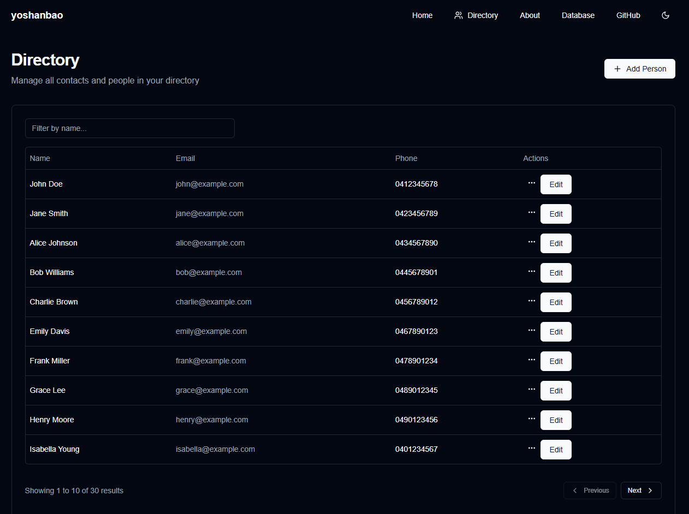
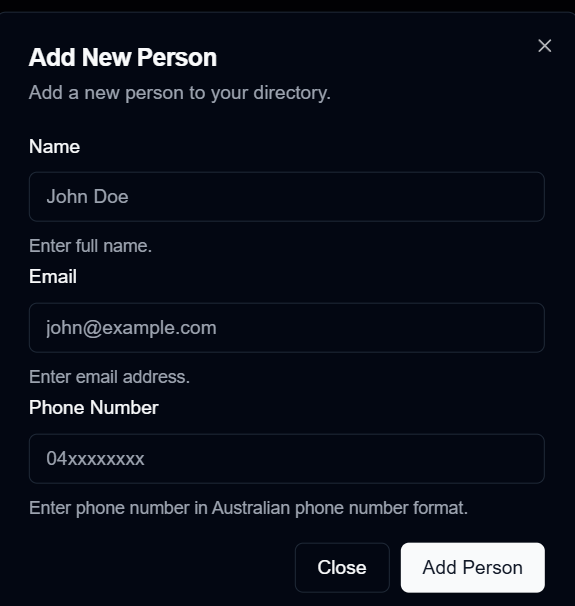
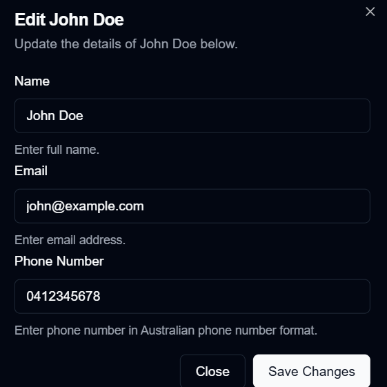
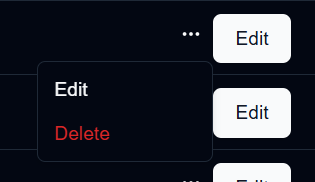
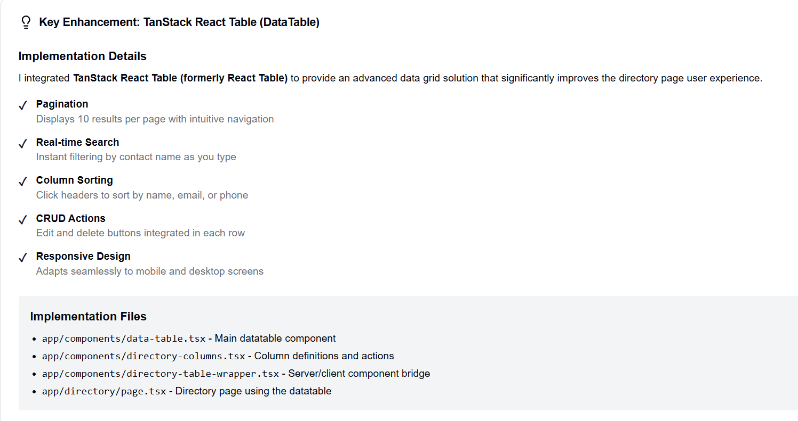

# Yoshanbao - Person Search & Contact Manager

## Summary

**Yoshanbao** is a modern contact management application built with **Next.js 16** and **React 19**, designed to help users efficiently manage and search through a directory of people. The application demonstrates advanced web development practices including server-side rendering, real-time search capabilities, and comprehensive CRUD (Create, Read, Update, Delete) operations.

### Key Highlights

- 📋 **Directory Management**: Browse and manage 30+ sample contacts in a searchable directory
- 📊 **Advanced DataTable**: Powered by TanStack React Table with pagination, sorting, and filtering
- 🔍 **Real-time Search**: Instant search filtering across all contact fields
- ✏️ **Full CRUD Operations**: Create, read, update, and delete contacts seamlessly
- 🎨 **Modern UI**: Built with Shadcn/ui components and Tailwind CSS
- 🌓 **Dark/Light Theme**: Complete theme support with next-themes
- 📱 **Responsive Design**: Fully responsive across all devices
- ✅ **Type-Safe**: Full TypeScript support with Zod schema validation
- 🚀 **Performance Optimized**: Next.js 16 with Turbopack and server components

### Application Pages

- **Home** (`/`) - Landing page with app overview
- **Directory** (`/directory`) - Contact management with datatable and CRUD operations
- **About** (`/about`) - Application architecture and technology stack
- **Database** (`/database`) - Database schema and implementation details
- **GitHub** (`/github`) - Repository information and project structure

## Visual Guide - Core Features Walkthrough

### 1. Directory Overview
The main directory page displays all 30+ contacts in a clean, organized interface with search and pagination capabilities.



**Purpose**: The directory page (`/directory`) serves as the main hub for contact management. It displays all contacts in a TanStack React Table with columns for Name, Email, Phone, and Actions. Features include:
- Real-time search filtering by contact name
- Pagination (10 items per page)
- Sorting by column headers
- Quick access to edit and delete operations

---

### 2. Add Person Feature
Click the "Add Person" button to open a dialog for creating new contacts.



**Purpose**: The Add Person feature allows users to quickly add new contacts to the directory. The dialog includes:
- **Name field**: Enter the contact's full name (minimum 2 characters)
- **Email field**: Enter a valid email address
- **Phone field**: Enter Australian phone number format (04XXXXXXXX)
- Form validation using Zod ensures all data meets requirements
- Server action (`addUser`) processes the submission and updates the directory in real-time

---

### 3. Edit Person Feature
Click the "Edit" button on any row to modify contact details.



**Purpose**: The Edit feature enables users to update existing contact information. It:
- Pre-fills the form with current contact data
- Allows modification of Name, Email, and Phone Number
- Uses the same validation rules as the Add feature
- Server action (`updateUser`) persists changes immediately
- Automatically refreshes the directory view after successful update

---

### 4. Delete Person Feature
Click the three-dot menu (⋯) on any row and select Delete to remove a contact.



**Purpose**: The Delete feature provides a quick way to remove contacts from the directory. It:
- Displays a confirmation menu when clicking the action button
- Shows a Delete option to remove the contact
- Uses server action (`deleteUser`) for secure deletion
- Automatically updates the directory after deletion
- Provides toast notification feedback on success

---

### 5. TanStack React Table - Light Mode Implementation
The datatable is built with TanStack React Table, featuring advanced data management capabilities.



**Purpose**: TanStack React Table powers the advanced datatable functionality with:
- **Pagination**: Navigate through large contact lists (10 items per page with Previous/Next controls)
- **Real-time Search**: Filter contacts by name instantly as you type
- **Sorting**: Click column headers to sort by Name, Email, or Phone
- **CRUD Actions**: Each row includes Edit and Delete buttons for easy management
- **Responsive Design**: Adapts seamlessly to different screen sizes
- **Light & Dark Mode**: Full theme support with Tailwind CSS

**Implementation Details**:
- Column definitions in `app/components/directory-columns.tsx`
- DataTable component in `app/components/data-table.tsx`
- Server-side data fetching with `getAllUsers()` action
- Client-side filtering, sorting, and pagination with React hooks

---

## Description

Person Search is a Next.js application upgraded to leverage **Next.js 16** and **React 19.2**. It demonstrates advanced search functionality using Next.js Server Components and react-select's `AsyncSelect` component. Users can search for people from a pre-populated list and view detailed information about the selected person.

The upgrade to Next.js 16 builds upon the async API changes from Next.js 15, with Turbopack now enabled by default and various performance improvements. See [docs/upgrading-next-16.md](docs/upgrading-next-16.md) for detailed upgrade notes.

## Features

- Asynchronous search functionality
- Server-side filtering of user data
- Server-rendered and hydrated client-side components
- Single data fetch for improved performance
- Responsive design using Tailwind CSS
- Accessibility-focused UI components from Radix UI
- Custom fonts (Geist Sans and Geist Mono)
- Improved type safety with TypeScript
- Modular and reusable component architecture

## Technologies Used

- **Next.js 16** - React framework with Turbopack by default
- **React 19.2** - Latest React version with View Transitions, useEffectEvent, and Activity
- **TypeScript 5+** - Strongly-typed superset of JavaScript
- **Node.js 20.9+** - Required for compatibility with Next.js 16
- **Tailwind CSS** - Utility-first CSS framework
- **Radix UI** - Collection of accessible, unstyled UI components
- **React Hook Form** - Performant and flexible forms library
- **Zod** - TypeScript-first schema declaration and validation library
- **React Select** - Flexible Select Input control for React
- **Sonner** - Lightweight toast notifications for React

### Minimum Node.js Version

The application requires **Node.js 20.9.0** or newer. Node.js 18 is no longer supported in Next.js 16.

## Getting Started


### Installation

1. Clone the repository:

   ```bash
   git clone https://github.com/gocallum/person-search.git
   cd person-search
   ```

2. Install dependencies:

   ```bash
   pnpm install
   ```

3. Create a `.env.local` file in the root directory and add any necessary environment variables.

### Running the Development Server

```bash
pnpm dev
```

### Other Commands

```bash
pnpm build    # Build for production
pnpm start    # Start production server
pnpm lint     # Run ESLint
```

## How It Works (Next.js 16 & React 19.2)

### Key Changes in `UserSearch` Component

1. **Server Component Design**:
   - The `user-search` component is now a **Server Component**, leveraging `searchParams` and fetching user details server-side.
   - `searchParams` are asynchronous (mandatory in Next.js 16 - synchronous access has been fully removed).

   ```tsx
   export default async function UserSearch({ searchParams }: { searchParams: Promise<{ userId?: string }> }) {
     const resolvedSearchParams = await searchParams;
     const selectedUserId = resolvedSearchParams?.userId || null;
     const user = selectedUserId ? await getUserById(selectedUserId) : null;

     return (
       <div className="space-y-6">
         <SearchInput />
         {selectedUserId && (
           <Suspense fallback={<p>Loading user...</p>}>
             {user ? <UserCard user={user} /> : <p>User not found</p>}
           </Suspense>
         )}
       </div>
     );
   }
   ```

2. **Improved Performance**:
   - Data fetching has been optimized to avoid redundant calls. The user object is fetched once in `user-search` and passed as a prop to child components like `UserCard` and `DeleteButton`.
   - This eliminates multiple fetches, improving performance and reducing server load.

3. **Interaction with `SearchInput`**:
   - `SearchInput` remains a **Client Component**, responsible for interacting with the user through `react-select`'s `AsyncSelect`.
   - When a user is selected, the URL is updated with the user's ID using `window.history.pushState`. This triggers a re-render of `user-search` to reflect the updated state.

4. **Improved Error Handling**:
   - Validations and controlled/uncontrolled input warnings have been resolved by ensuring consistent handling in forms using React Hook Form and Zod.

5. **Concurrency & Hydration**:
   - React 19.2's concurrent rendering and Next.js 16's support for server components ensure seamless server-client hydration, reducing potential mismatches.

### Known Issues

1. **Toast Messages**:
   - Notifications in `DeleteButton` and `MutableDialog` are currently not showing. This requires debugging the integration of the `Sonner` toast library.

2. **Theme Support**:
   - The `theme-provider` for managing dark and light modes has been removed temporarily. The Tailwind stylesheets need to be updated to align with the new Next.js configuration.

3. **Hydration Warnings**:
   - Some hydration warnings may occur due to external browser extensions like Grammarly or differences in runtime environments. Suppression flags have been added, but further testing is recommended.

---

### Updated Project Structure

```
person-search/
├── app/
│   ├── components/
│   │   ├── user-search.tsx
│   │   ├── search-input.tsx
│   │   ├── user-card.tsx
│   │   ├── user-dialog.tsx
│   │   └── user-form.tsx
│   ├── actions/
│   │   ├── actions.ts
│   │   └── schemas.ts
│   └── page.tsx
├── public/
├── .eslintrc.json
├── next.config.js
├── package.json
├── README.md
├── tailwind.config.ts
└── tsconfig.json
```

### Using `MutableDialog`

The `MutableDialog` component is a reusable dialog framework that can be used for both "Add" and "Edit" operations. It integrates form validation with Zod and React Hook Form, and supports passing default values for edit operations.

#### How `MutableDialog` Works

`MutableDialog` accepts the following props:
- **`formSchema`**: A Zod schema defining the validation rules for the form.
- **`FormComponent`**: A React component responsible for rendering the form fields.
- **`action`**: A function to handle the form submission (e.g., adding or updating a user).
- **`defaultValues`**: Initial values for the form fields, used for editing existing data.
- **`triggerButtonLabel`**: Label for the button that triggers the dialog.
- **`addDialogTitle` / `editDialogTitle`**: Titles for the "Add" and "Edit" modes.
- **`dialogDescription`**: Description displayed inside the dialog.
- **`submitButtonLabel`**: Label for the submit button.

#### Example: Add Operation

To use `MutableDialog` for adding a new user:

```tsx
import { MutableDialog } from './components/mutable-dialog';
import { userFormSchema, UserFormData } from './actions/schemas';
import { addUser } from './actions/actions';
import { UserForm } from './components/user-form';

export function UserAddDialog() {
  const handleAddUser = async (data: UserFormData) => {
    try {
      const newUser = await addUser(data);
      return {
        success: true,
        message: `User ${newUser.name} added successfully`,
        data: newUser,
      };
    } catch (error) {
      return {
        success: false,
        message: `Failed to add user: ${error instanceof Error ? error.message : 'Unknown error'}`,
      };
    }
  };

  return (
    <MutableDialog<UserFormData>
      formSchema={userFormSchema}
      FormComponent={UserForm}
      action={handleAddUser}
      triggerButtonLabel="Add User"
      addDialogTitle="Add New User"
      dialogDescription="Fill out the form below to add a new user."
      submitButtonLabel="Save"
    />
  );
}
```

#### Example: Edit Operation

To use `MutableDialog` for editing an existing user:

```tsx
import { MutableDialog } from './components/mutable-dialog';
import { userFormSchema, UserFormData } from './actions/schemas';
import { updateUser } from './actions/actions';
import { UserForm } from './components/user-form';

export function UserEditDialog({ user }: { user: UserFormData }) {
  const handleUpdateUser = async (data: UserFormData) => {
    try {
      const updatedUser = await updateUser(user.id, data);
      return {
        success: true,
        message: `User ${updatedUser.name} updated successfully`,
        data: updatedUser,
      };
    } catch (error) {
      return {
        success: false,
        message: `Failed to update user: ${error instanceof Error ? error.message : 'Unknown error'}`,
      };
    }
  };

  return (
    <MutableDialog<UserFormData>
      formSchema={userFormSchema}
      FormComponent={UserForm}
      action={handleUpdateUser}
      defaultValues={user} // Pre-fill form fields with user data
      triggerButtonLabel="Edit User"
      editDialogTitle="Edit User Details"
      dialogDescription="Modify the details below and click save to update the user."
      submitButtonLabel="Update"
    />
  );
}
```

### Note: Future Refactoring for `ActionState` with React 19

The `MutableDialog` component currently uses a custom `ActionState` type to handle the result of form submissions. However, React 19 introduces built-in support for `ActionState` in Server Actions, which can simplify this implementation. 

#### Improvements to Make:
- Replace the custom `ActionState` interface with React 19's built-in `ActionState`.
- Use the `ActionState` directly within the form submission logic to align with React 19 best practices.
- Refactor error handling and success notifications to leverage React's server-side error handling.

This will be addressed in a future update to ensure the `MutableDialog` component remains aligned with React 19's capabilities.

## Contributing

Contributions are welcome! Please submit a Pull Request with your changes.

## License

This project is open source and available under the [MIT License](LICENSE).


## Contact

Callum Bir - [@callumbir](https://twitter.com/callumbir)  
Project Link: [https://github.com/gocallum/person-search](https://github.com/gocallum/person-search)  

